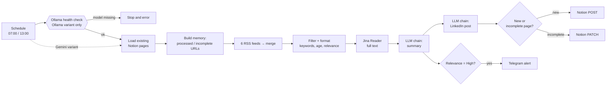

# LLM news-monitoring pipeline for n8n (Ollama / Gemini)

An n8n workflow that reads RSS feeds, filters articles by keyword relevance, fetches the full text, and runs two LangChain chains on a single chat model: a 3-bullet summary and a LinkedIn post draft. Results are upserted into a Notion database, and high-relevance items are sent to Telegram. The model backend is either a local Ollama instance (`qwen2.5:14b`) or Gemini (`gemini-2.5-flash`).

Example configuration: ad-tech news (6 RSS sources).

## Architecture



Two variants are generated from the same script:

| File | Nodes | Model |
|------|-------|-------|
| `veille-ads-perso-ollama-v19.json` | 28 | Ollama `qwen2.5:14b` (local) |
| `veille-ads-perso-gemini-v19.json` | 25 | Gemini `gemini-2.5-flash` (cloud) |

The Gemini variant has no health check; the three extra nodes in the Ollama variant are the check, the IF and the stop node.

## Engineering choices

- **Local/cloud model switch with a blocking health check.** The Ollama variant calls `GET /api/tags` first and continues only if the response contains `qwen`; otherwise a Stop-and-Error node ends the run before any Notion, RSS or Jina call. The Gemini variant uses the same pipeline without that gate.
- **Two LangChain chains sharing one model.** The summary and LinkedIn chains (`chainLlm` 1.9) are both wired to a single chat-model node through `ai_languageModel`. Both set `onError: continueErrorOutput`, and their error outputs go to a NoOp node (*Erreur LLM — article ignoré*), so a failing item does not abort the run and is visible in the execution view. The item is not written to Notion and is not retried within that run; since its URL is already marked as processed in static data, it is only picked up again if the Notion page exists but is incomplete.
- **Idempotent Notion upsert.** Existing pages are loaded first. Pages that already have both a summary and a LinkedIn draft are marked as processed. Pages missing one of the two fields are patched (PATCH) with only the missing field; unknown articles are created (POST). Re-running does not create duplicates.
- **Workflows generated by script.** `build_veille_v19.py` builds both JSON files from one definition (nodes, prompts, Code-node sources, connections) and re-parses each file after writing it.
- **Relevance filtering before any LLM call.** Articles older than 7 days, already processed, not matching the keyword list, or scored "Low" are dropped before the Jina fetch and the LLM chains. Remaining items are sorted High first.

## Quick start

1. In Notion, create a database with these properties: `Titre` (title), `Source` (select), `URL` (url), `Tags` (multi-select), `Date` (date), `Pertinence` (select), `Résumé` (rich text), `Idée post LinkedIn` (rich text). Share it with your Notion integration.
2. Set `VEILLE_DB_ID` at the top of `build_veille_v19.py` to your database ID, then regenerate (see below). The credential IDs in the script (`NOTION_CRED`, `TELEGRAM_CRED`, `GEMINI_CRED`, `OLLAMA_CRED`) are n8n-internal IDs from the author's instance; after import, re-select your own credentials on each node.
3. In n8n: **Import from file** → one of the two JSON files. Activate only one of them.
4. Credentials:
   - **Notion** — used by the `getAll` node and by the two HTTP PATCH/POST nodes.
   - **Telegram** — and replace `REMPLACER_PAR_CHAT_ID` with your chat ID in the Telegram node.
   - **Ollama** (Ollama variant) — the health-check URL is hardcoded to `http://host.orb.internal:11434` (OrbStack); change `OLLAMA_BASE` in the script if your host differs, and set the same base URL in the Ollama credential.
   - **Google Gemini API** (Gemini variant).
5. Ollama variant: make sure the model is available (`ollama pull qwen2.5:14b`). A manual run should pass **Check Ollama UP** and **Ollama disponible ?**.
6. Activate the workflow. The schedule is `0 7,13 * * *` (twice a day, every day), timezone `Europe/Paris`.

## Adapting it to another topic

All topic-specific content lives in a few places in `build_veille_v19.py`:

- **Sources** — the `RSS_FEEDS` list (URL, name). The merge node is named "Fusionner 6 flux" and the connections are built from this list; the Merge node's `numberInputs` follows the list length.
- **Keywords and scoring** — the `FILTER_PERSO` code (node *Filtrer + Formater*): the `relevant` list (an article must contain at least one term), the tag rules, and the `highValue` list (0 matches = Low and dropped, 1–2 = Medium, 3+ = High). Telegram alerts only fire on High.
- **Prompts** — `SUMMARY_PROMPT` and `LINKEDIN_PROMPT`. Both are written in French and target a PPC/automation agency; rewrite the role, language and constraints.
- **Notion property names** — used in `SEED_CODE` and `NOTION_PAYLOAD`.

Then run `python3 build_veille_v19.py` and re-import the JSON.

## Regenerating the workflows

```bash
python3 build_veille_v19.py
```

The script writes both JSON files next to itself and re-parses them after writing (node counts: 28 Ollama, 25 Gemini).

<details>
<summary>Node-by-node documentation</summary>

### Guide — Veille Perso v19
Sticky note on the canvas (backend, chains, cron).

### 7h + 13h — Tous les jours
`scheduleTrigger`, cron `0 7,13 * * *`. Output goes to **Check Ollama UP** (Ollama variant) or **Charger URLs Notion** (Gemini variant).

### Check Ollama UP *(Ollama variant only)*
`httpRequest` GET `{OLLAMA_BASE}/api/tags`, 8 s timeout. Runs before any other work so an unavailable Ollama stops the run early.

### Ollama disponible ? *(Ollama variant only)*
`if` v2.2. Condition: `JSON.stringify($json)` contains `qwen` (case-insensitive). True → **Charger URLs Notion**; false → **Stop — Ollama indisponible**. The check matches the substring `qwen`, not the exact tag `qwen2.5:14b`.

### Stop — Ollama indisponible *(Ollama variant only)*
`stopAndError` with a message pointing to OrbStack / `ollama pull qwen2.5:14b`.

### Charger URLs Notion
`notion` getAll on the database, all pages, `alwaysOutputData`.

### Initialiser mémoire
`code`. Writes to workflow static data: `processedUrls` (pages that have both fields longer than 10 characters, merged with previous values, capped at the last 2000) and `needsUpdate[url]` (page ID plus which fields are missing). Fans out to the 6 RSS nodes.

### RSS ×6 + Fusionner 6 flux
`rssFeedRead` × 6 (Search Engine Land, AdExchanger, PPC Hero, Search Engine Journal, n8n Blog, WordStream) → `merge` v3, mode `append`, `numberInputs` = 6.

### Filtrer + Formater
`code`. Drops items without title/URL, duplicates, URLs already in `processedUrls`, items older than 7 days, items with no keyword match, and items scored Low. Assigns tags and a relevance level (High/Medium), and marks items found in `needsUpdate` with `_updateMode`, `_pageId`, `_needsResume`, `_needsLinkedin`. Sorts High first. Adds the new URLs to `processedUrls`.

### Jina — Lire Article
`code` (run once per item). Fetches `https://r.jina.ai/{url}` and keeps the first 4000 characters; falls back to the RSS snippet on error or short/error responses.

### Résumé IA — Basic LLM Chain
`chainLlm` 1.9, `onError: continueErrorOutput` (error output → *Erreur LLM — article ignoré*). French summary, exactly 3 points with `•`, 120 words max.

### Post LinkedIn — Basic LLM Chain
`chainLlm` 1.9, `onError: continueErrorOutput` (error output → *Erreur LLM — article ignoré*). French LinkedIn post, 150–200 words, built from the title and the summary.

### Ollama Chat Model / Google Gemini Chat Model
`lmChatOllama` (`qwen2.5:14b`, temperature 0.4, `numPredict` 400) or `lmChatGoogleGemini` (`gemini-2.5-flash`, temperature 0.4, `maxOutputTokens` 450). Connected to both chains through `ai_languageModel`.

### Erreur LLM — article ignoré
`noOp`. Receives the error output of both chains; nothing is written to Notion or sent to Telegram for these items.

### Assembler Article + Résumé IA
`code`. Reads the chain output (`text` or `output`), builds `ai_summary` and the Telegram message, and drops the full article text. Feeds two branches: the LinkedIn chain and the Telegram filter.

### Assembler Post LinkedIn
`code`. Adds `linkedinPost` to the previous item.

### Build Notion Payload
`code`. Builds partial properties for updates (only the missing field) or full properties for new pages.

### Nouveau ou Mise à jour ?
`if` v2.2 on `_updateMode === true`. True → PATCH, false → POST.

### Notion — Mettre à jour Page / Créer Page
`httpRequest` PATCH `/v1/pages/{id}` or POST `/v1/pages`, `Notion-Version: 2022-06-28`, `continueOnFail: true`.

### Seulement Haute pertinence
`filter` v2.2: `pertinence` contains `Haute`.

### Telegram — Alerte
`telegram`, Markdown, link preview disabled, `continueOnFail: true`.

</details>
